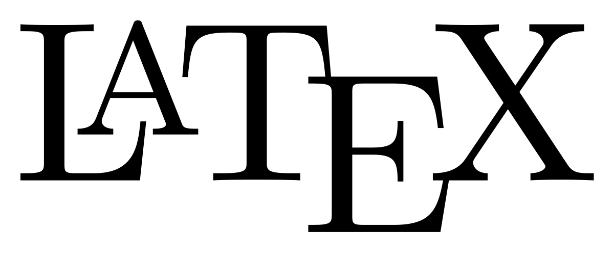

## Hi there 👋
- 🔭 I’m currently working on school work.
- 🌱 I’m currently learning neural network infrastructure and fundamental architectures.
- ⚡ Fun fact: More time with machine than with folks in the past
- 👯 I'm looking to meet nice people and make friends!

## Statistics

## Tech Stack

    
    
    
    
    
    
    
    
    

<!--
**jhzhics/jhzhics** is a ✨ _special_ ✨ repository because its `README.md` (this file) appears on your GitHub profile.

Here are some ideas to get you started:

- 🔭 I’m currently working on ...
- 🌱 I’m currently learning ...
- 👯 I’m looking to collaborate on ...
- 🤔 I’m looking for help with ...
- 💬 Ask me about ...
- 📫 How to reach me: ...
- 😄 Pronouns: ...
- ⚡ Fun fact: ...
-->
